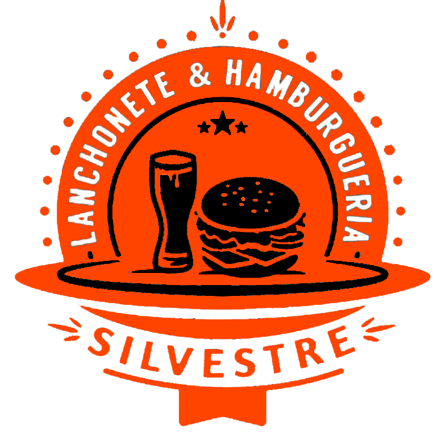

<p align="center">
  
</p>
<h3 align="center">
sistema de pedidos online
</h3>
<br>

## Silvestre Lanchonete

Descrição do Projeto: Sistema de Pedidos Online

Nosso sistema de pedidos online foi projetado para proporcionar uma experiência de usuário simples e eficiente para os clientes de uma lanchonete. A seguir, estão os principais recursos e funcionalidades do sistema:

Tela Principal
Informações sobre a Lanchonete: A tela principal oferece uma visão geral da lanchonete, incluindo descrições, imagens, horários de funcionamento e informações de contato.

Acesso ao Cardápio: De forma destacada, a tela principal fornece acesso direto ao cardápio da lanchonete, permitindo que os clientes naveguem pelos pratos e bebidas disponíveis.

Cardápio
Navegação por Sessões: O cardápio é organizado em seções específicas, como "Pratos do Dia", "Pratos Executivos", "Pratos Especiais", "Hambúrgueres & Beirutes", e "Bebidas". Isso facilita a navegação e a busca pelos itens desejados.

Seleção de Bebidas: Além dos pratos principais, o cliente pode selecionar diversas opções de bebidas, que são categorizadas e facilmente acessíveis.

Funcionalidades de Busca e Seleção
Busca de Pratos: O sistema inclui uma funcionalidade de busca que permite aos clientes procurar por pratos específicos, agilizando o processo de encontrar exatamente o que desejam.

Adicionar à sacola: Uma vez encontrado o prato ou bebida desejado, o cliente pode adicioná-lo à sua sacola de compras com um único clique.

Envio de Pedidos via WhatsApp: Após finalizar a seleção de itens, o cliente pode enviar o pedido diretamente para o WhatsApp da lanchonete, facilitando a comunicação e a confirmação do pedido.

Sacola de Compras
Visualização da Sacola: O cliente pode visualizar todos os itens adicionados à sacola, ver os detalhes e valores, e fazer ajustes antes de finalizar o pedido.

Finalização e Envio: Com todos os itens confirmados, o cliente pode finalizar o pedido e enviá-lo através do WhatsApp, onde receberá uma confirmação rápida e poderá acompanhar o status do seu pedido.

Este sistema foi desenvolvido para otimizar o processo de pedido, melhorar a experiência do cliente e aumentar a eficiência operacional da lanchonete. Utilizando tecnologias modernas como React, TypeScript, e Tailwind CSS, garantimos uma interface amigável, responsiva e fácil de usar.

## instalação

Antes de começar, você precisará ter as seguintes ferramentas instaladas em sua máquina:
[Git](https://git-scm.com), [Node.js](https://nodejs.org/en/).
Também é bom ter um editor para trabalhar com o código como [VSCode](https://code.visualstudio.com/).

### 🖥️ Rodando o Front End (Web)

```bash
# clonando o repositório
$ git clone https://github.com/Caique017/Silvestre_Lanchonete.git

# Acessando projeto pelo terminal/cmd
$ cd Silvestre_Lanchonete

# Instalando dependências
$ npm install
# Se você preferir usar o Yarn, execute o comando abaixo
$ yarn install

# Execute o aplicativo em modo de desenvolvimento
$ npm run dev
# Se você preferir usar o Yarn, execute o comando abaixo
$ yarn dev

# O servidor iniciará na porta 5173 - vá para <http://localhost:5173>
```

## Tecnologias

[](https://skillicons.dev)